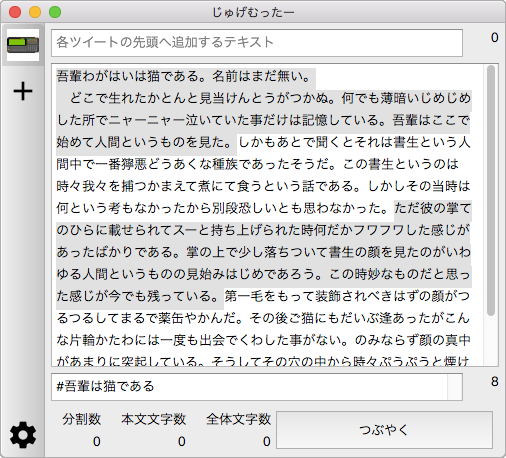

# じゅげむったー

長文投稿専用ツイッタークライアントです。

タイムラインの表示などの機能は一切ありません。

## ビルド方法

Qt Creator の「プロジェクト」→「ビルド設定」→「ビルドステップ」→「追加の引数」に

`DEFINES+=TWITTER_APP_KEY="{app key}"` と `DEFINES+=TWITTER_APP_SECRET="{app secret}"` を指定する必要があります。

キーは [Create an application | Twitter Application Management](https://apps.twitter.com/app/new) から取得し設定してください。

## ライセンス

© 2017 sharkpp

このアプリケーションは [MIT ライセンス](LICENSE.ja-JP) の下で提供されています。
